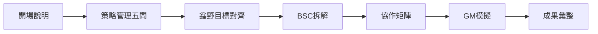
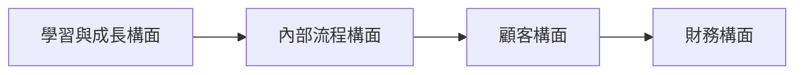

# 執行摘要  
本課程「高階經營管理轉型思維」是為鑫野智動高階主管設計的**兩小時互動式工作坊**，主軸是對齊公司 2026 年營運策略（年度銷貨 8,000 萬、淨利增加 500 萬等目標），並將這些策略拆解到各部門行動方案中。課程結合**平衡計分卡 (BSC)** 分析方法與**跨部門協作矩陣**，透過講授、AI 問答輔助與小組實作，引導各部門（業務部、開發部、資材部、製造部、永續發展處）完成部門定位、目標拆解、行動方案與 KPI 設定，最後模擬向總經理報告並接受質詢。課程產出包括各部門策略報告初稿、KPI 清單、協作矩陣等，為後續策略執行、績效管理與人才發展課程奠定基礎。  

---  

## 課程緣起與學習目標  
鑫野智動 2026 年已訂定年度營運策略目標：銷貨 8,000 萬、淨利增加 500 萬，以及 AI 賦能、SOP 化、內部知識傳承等成長目標。這些目標必須由公司各部門**共同承擔與協作**才能達成。本課程目的是：  
- **對齊公司目標**：讓高階主管了解公司整體策略及關鍵指標，明白各部門在策略中的定位和責任。  
- **拆解部門責任**：運用**平衡計分卡 (Balanced Scorecard, BSC)** 將總目標拆解到各部門的具體目標和行動上【2†L52-L60】。BSC 的四大構面——財務、顧客、內部流程、學習與成長——可協助主管從多角度思考：如何同時管理當前績效與未來能力【2†L52-L60】、如何將長期與短期、財務與非財務指標取得平衡【8†L108-L117】【8†L62-L70】。  
- **建立協作機制**：透過「部門策略協作矩陣」，盤點每項策略行動所需的跨部門配合，讓高階主管知道「我需要誰」與「誰需要我」，避免各自為政。策略成功的因果邏輯示意如下：**學習與成長→提升內部流程效率→提高客戶滿意度→最終帶動財務成果**【9†L1-L4】。  
- **實作與 AI 互動**：結合 AI 問答輔助工具，引導主管完成部門策略構思，並以角色扮演方式模擬總經理會議，確保產出可操作、可追蹤且可向高層報告。  

完成課程後，學員應能：  
- 說明高階經營管理要管目標、資源、流程、人才與未來成長；  
- 使用 BSC 進行部門策略拆解並建立因果邏輯【2†L52-L60】【9†L1-L4】；  
- 將公司 8,000 萬營收、淨利 500 萬等目標轉化為部門具體目標與行動方案；  
- 設計可量化的部門 KPI 與追蹤機制；  
- 辨識並安排跨部門協作需求；  
- 完成可向總經理報告的策略草案，並為後續績效管理、TTQS、職能發展等課程準備基礎資料。  

---  

## 課程議程與方法（2 小時版本）  

| 時間         | 單元                                 | 形式               | 產出                     |
|-------------|--------------------------------------|--------------------|--------------------------|
| 0:00–0:10   | **開場說明與目標對齊**               | 講授＋提問        | 確認課程目標與學習預期    |
| 0:10–0:25   | **策略經營管理要管什麼**             | 講授＋討論        | 理解高階管理五大核心議題 |
| 0:25–0:40   | **鑫野2026目標與部門定位**           | 講授＋案例說明    | 公司目標與部門角色共識    |
| 0:40–1:10   | **BSC 部門策略拆解（AI 引導實作）**  | AI互動＋小組討論 | 部門 BSC 行動方案草案    |
| 1:10–1:25   | **跨部門協作矩陣實作**               | 小組討論＋填表    | 協作需求與支援清單      |
| 1:25–1:45   | **總經理會議模擬 Q&A**               | 角色扮演＋反饋    | 部門策略修正建議         |
| 1:45–2:00   | **成果彙整與後續任務**               | 講授＋討論        | 確認後續交付品與追蹤計畫  |

- **開場與目標對齊**：說明課程主題、方式與預期，強調「不是聽理論而是產出策略報告」，激發主管參與意願。  
- **策略經營管理五大問**：講師介紹「策略經營管理要管什麼」：我要去哪裡？(公司目標)、現在在哪裡？(部門現況)、差距在哪？(目標落差)、誰要做什麼？(部門定位與責任)、如何追蹤？(KPI機制)【2†L52-L60】【9†L1-L4】。用簡單案例說明「管目標、管資源、管流程、管人才、管未來」的內涵。  
- **鑫野2026目標說明**：結合計畫書與策略地圖，對齊「營收 8,000 萬、淨利 500 萬、新收入目標、AI 賦能、SOP/知識傳承、TTQS/技能認證」等重點。引導學員思考：若公司要達此目標，我們部門的定位是什麼？必須完成哪些任務？  
- **BSC 部門策略拆解（AI 互動）**：使用平衡計分卡作為主架構，分財務、顧客、流程、學習成長四面向，引導各部門依序思考回答：  
  - 財務面：部門如何直接支撐 8,000 萬營收或改善毛利成本？（如業務部「擴大客戶數」、製造部「降低廢品率」等）  
  - 顧客面：部門如何提升客戶、代理商或市場的價值感受？  
  - 內部流程：部門內哪些流程需改善才能流暢支撐目標？  
  - 學習成長：部門需要補哪些能力、制度、工具或數據以支撐未來？  
  此階段使用 AI 輔助對話（AI Skill）：學員與 AI 助手互動，獲取靈感與提示，並在小組中交流、整理，完成**部門 BSC 策略拆解表**（見下方模板）。【2†L52-L60】【9†L1-L4】  
- **跨部門協作矩陣實作**：各部門根據剛整理的行動方案，盤點「我需要誰」「誰需要我」。填寫**部門策略協作矩陣**：列出本部門行動、需求協作的部門與支援內容，以及本部門可支援的他部門事項。強調策略落地非孤軍奮鬥，透過問答讓學員理解協作要點。  
- **總經理會議模擬 Q&A**：各部門簡短報告策略草案（口頭或板書）。講師或 AI 扮演總經理角色，針對各部門簡報進行提問，引導學員檢視內容完整度。可能問題包括：「這個目標怎麼來的？怎麼符合 8,000 萬？」「資源夠嗎？需要哪些支持？」「如果沒有達標有什麼風險、應對方案？」等，訓練學員用事實與數據回應。現場即時給予建議，學員修正方案。  
- **成果彙整與後續任務**：講師總結各部門策略要點、宣布課後報告格式要求與後續收集表單，說明部門需完善的資料（KPI 具體數值、協作負責人、流程圖等）以及後續訪廠跟進計畫。提醒學員本次產出將作為後續人力發展與績效管理的基礎。  

**3小時延伸版建議**：如時間允許，可增加「深入剖析策略地圖」、「部門分組討論時間」及「角色扮演強化」，如：  
- **+20 分鐘**：更詳盡解讀鑫野策略地圖每項指標，讓學員更深入了解 KPI 來源；  
- **+20 分鐘**：小組間交叉討論部門草案，互相質詢與改進；  
- **+20 分鐘**：分組角色扮演模擬總經理與董事會，強化口頭表達與即席應答能力。  

以上議程兼顧講授、AI互動、分組實作與角色扮演，確保學員**聽得懂**、**做到**並**帶得走**。教學中將穿插**表單工作表**與**AI Skill 引導**，讓學員實際操作產出。

---

## 方法論與工具整合  

- **平衡計分卡 (BSC)**：以**財務、顧客、內部流程、學習成長**四個構面拆解策略，將總經理級目標分解為部門可執行的行動方案。【2†L52-L60】【9†L1-L4】例如：永續發展處可提出培訓課程、AI專案等「學習面行動」，帶動製造、開發等部門流程優化，最終提升公司營收。BSC 讓策略**從願景轉化為具體行動**【2†L52-L60】，並強調各構面間的**因果鏈結**：學習與成長→流程效率→顧客滿意→財務成果【9†L1-L4】。  
- **部門策略協作矩陣**：避免各部門**各唱各的調**，在表格中對照本部門「做什麼」與「需要誰協助」，確保每項關鍵行動的執行者與配合者清晰可見，便於總經理檢視責任分工。例如：製造部推動「生產流程SOP化」，需開發部提供圖面穩定性分析、資材部提供材料穩定度資訊，並需總經理協調人力與時間表。  
- **PDDRO 執行循環**：課程強調 PDCA 管理，但參考 TTQS 人才培訓體系，引入 **PDDRO (Plan-Design-Do-Review-Outcome)** 概念【5†L12-L16】。每個部門策略行動都應有計畫 (Plan)、設計執行方案 (Design/Do)、定期檢核 (Review)，並評估成果 (Outcome) 以迭代改進。這與 TTQS 訓練管理 5 階段相呼應，可為未來員工培訓與績效回饋奠定邏輯基礎。  
- **AI Skill 引導**：利用 AI 虛擬助理（如內部 Chatbot）做為輔助，提出引導問題、收斂思考。例如在 BSC 拆解階段，AI 可提示「請列出部門在財務構面可做的三件事」，或在協作盤點階段詢問「此行動需要哪些部門的配合？」。課程中會提供**AI Skill 對話流程範例**與樣本回應，指導學員如何提問與記錄答案，使策略構思更全面。  

以上方法論結合，使策略管理不再抽象，學員能理解並操作「目標→分析→行動→追蹤」的全程流程。  

---

## 課程流程圖與策略因果鏈示意





前述流程圖描述課程六個階段的先後關係；因果鏈圖示平衡計分卡在策略上的影響路徑：員工學習與成長促進內部流程效率，進而提高客戶滿意度，最終帶動財務指標提升【9†L1-L4】。

---

## 詳細逐字稿示例

以下提供各時段講師可能使用的**逐字稿（話術）**與提示。講稿風格參考企業內訓，採對話引導與說明並重。

### 0:00–0:10 課程開場與目標對齊  
「各位主管，大家好，歡迎參加今天的工作坊。課程名稱是『高階經營管理轉型思維』。為什麼要辦這堂課？簡單說，我們要把**鑫野2026年年度目標**（8,000 萬營收、500 萬淨利等等）拆解到各部門來做，讓每個部門都有清晰的角色和行動計畫。今天的重點不是讓大家聽一堆經營理論，而是**動手實作**，我們要每位部門主管在兩小時內，完成一份可跟總經理報告的策略草案。  

具體來說，我們要回答：如果公司明年要達成 8,000 萬營收，我**的部門**要負責什麼？要推動哪些事情？需要什麼資源？以及怎麼追蹤成效？  

今天流程包含講師講解、AI 助手互動、分組討論，最後還會有一段模擬與總經理報告的 Q&A。我的目標是，大家**聽懂**、**做得到**、**帶得走**。二十分鐘後，你們就能開始跟 AI 問答，提出自己部門的策略方案。好，請各位先打開筆記、連接好 AI 助手，我們現在開始。  

(筆記：確認投影顯示公司策略地圖概要；同時確認每位學員登入 AI 系統準備提問。)」

### 0:10–0:25 策略經營管理要管什麼  
「接下來我們討論一個重要概念：**策略經營管理到底在管什麼**。很多人以為策略是高層的事，只管訂目標。但實際上，策略要能落地，需要考慮五大問題：**我要去哪裡、現在在哪裡、差距在哪裡、誰做什麼、如何追蹤**。  

第一，『我要去哪裡？』就是公司的目標：比如明年 8,000 萬營收、500 萬淨利、AI 應用、內部人才傳承等。  
第二，『現在在哪裡？』講的是我們目前的狀況：訂單、產能、人力、技術等情況。  
第三，『差距在哪裡？』就是兩者的落差，可能是缺人缺錢、流程卡住、能力不足等問題。  
第四，『誰做什麼？』就是部門定位與責任分工：這就是今天重點—每個部門要站在「老闆視角」，想清楚部門角色。  
第五，『如何追蹤？』則是要訂 KPI 和機制，讓我們能即時檢視進度，不讓策略流於空談。  

總結一句：策略管理要**管目標、管資源、管流程、管人才、管未來**。舉例來說，業務部不只是追訂單，更要思考「如何支撐整個 8,000 萬目標」、開發部不只是畫圖面，更要想「如何提供客戶願意買的方案」；製造不只是生產，更要有**流程標準化與品質**；永續發展處不只是推訓練，更要推**AI 賦能、SOP 化**。  

大家可以舉個例子：比如說，今年營收增長需要新客戶，業務不斷放電，但如果我們**不改善設計圖錯誤**（開發的流程問題）或**不加強供應商管理**（資材的流程問題），就算有機會也無法落實。換句話說，策略最後都要回到具體的行動和協作。【9†L1-L4】【2†L52-L60】  

(提示：講師可以先舉鑫野歷年業績簡例，引導反思「目標只定在高層，部門就算再努力也推不動」。)」

### 0:25–0:40 鑫野 2026 目標與部門定位對齊  
「接下來，我們看**鑫野智動的具體目標**。根據公司策略地圖，2026 年我們要達到**年度營收 8,000 萬**（業務部接單額）、**淨利提升 500 萬**。除此之外，還有**永續發展處**要達成的新收入目標，以及推動 **AI 應用／SOP化**、**內部技能認證 (TTQS)** 等。在後面的課程中，各位都要按照這些指標思考。  

請各位部門主管思考：以你們部門的職掌，**怎樣做能貢獻到這些目標**？舉例：  
- 業務部：核心是接單、開發代理商與客戶，會關心如何達成 8,000 萬接單量、提高成交率；  
- 開發部：核心是產品開發與設計，會關心如何提供足夠且可行的技術方案，降低設計錯誤；  
- 資材部：負責採購與供應鏈，會關心採購成本與供應穩定，避免缺料；  
- 製造部：負責生產與交付，會關心如何提升產能、提高良率、落實SOP；  
- 永續發展處：負責制度與人才，會關心內訓與AI工具導入，使全公司更有組織韌性。  

接下來我們要進入實作：請每位想好一句話定位（演練表述）：「我們是**○○部門**，在公司 8,000 萬目標中，主要負責___，並透過___支撐公司成長。」講一輪大家互相交流，你們想寫在筆記上就好。  

(提示：講師板書企業策略目標、部門名稱，並可提供範例定位語，例如業務部：「我們是市場開發部，負責接單與客戶維繫，透過精準的商機管理支撐營收目標。」)」

### 0:40–1:10 部門策略拆解（BSC＋AI 實作）  
「現在進入關鍵環節：**各部門策略拆解**。我們用前面提到的 BSC 四個構面（財務、顧客、流程、學習與成長）來思考。請各部門依序作答下列問題，並在工作表上寫下初步答案（表格範例如下所示）：  

- **財務構面**：你的部門如何幫公司賺錢、或降低成本、提高效率？（例如業務部：目標接單金額 8000 萬；製造部：提高生產效率降低單位成本；開發部：支援新產品以提高毛利；永續發展處：開拓新收入管道）  
- **顧客構面**：你的部門如何提升客戶、代理商或市場的價值？（例如業務部：提高客戶滿意度與回購率；開發部：提高技術方案信任度；製造部：提升交期可靠度；資材部：穩定供應保證交付）  
- **內部流程構面**：有哪些流程如果不改善就會卡住公司目標？（如接單到出貨流程、設計變更流程、採購與庫存流程等）。  
- **學習成長構面**：部門需要強化哪些能力或系統？（如AI工具應用、SOP/制度建立、人才培訓計畫）。  

**AI 互動引導**：請每個小組指定一人向 AI 助手提問（例如：「開發部：請列出你們部門在財務構面能做的三件事？」），收集靈感再補充。AI 助手會根據問題給出提示，你們可以當參考，最後由小組討論合併。  

各部門有 15 分鐘分組討論並填寫**「部門 BSC 策略拆解表」**，之後每組分享一個關鍵行動供其他組參考。  

*(提示：講師巡迴協助使用 AI 工具，例如示範對話：「AI 請問，資材部如何在內部流程面支撐交期？」引導小組使用AI，並提醒書寫重點不多於3條。)*【2†L52-L60】【9†L1-L4】」

> **部門 BSC 策略拆解表（示意）**  
> | 部門   | 財務構面（財務貢獻）        | 顧客構面（顧客價值）            | 內部流程構面（流程改善）          | 學習成長構面（能力建設）          |
> |--------|----------------------------|------------------------------|---------------------------------|-----------------------------|
> | 業務部 | 接單金額、毛利率提升        | 客戶開發、回購率、滿意度       | 商機流程管理、報價效率          | 業務談判技巧、AI行銷應用        |
> | 開發部 | 支援新產品專案、設計成本控管 | 技術方案成功率、客戶需求符合法 | 設計流程優化、變更管理           | 技術知識庫、AI輔助設計工具      |
> | 資材部 | 採購成本降低、庫存周轉率     | 穩定供應商網絡、交期可靠度     | 採購流程標準化、供應商評鑑       | 供應鏈數據分析、採購技能培訓    |
> | 製造部 | 生產效率提升、品質合格率     | 交貨準時率、品質穩定度         | SOP化、快速反應製程             | 技能認證培訓、設備自動化         |
> | 永續發展處 | 新收入管道（AI專案）      | 公司形象(ESG)、永續認證支持    | 培訓管理系統、TTQS達標           | 內部講師培訓、知識分享平台      |

*(註：表格為示意，實際填寫由各組自行完成。)*  

### 1:10–1:25 跨部門協作矩陣  
「現在請各部門檢視剛才列出的重點行動，思考『這些行動需要哪些其他部門協作？』以及『其他部門需要本部門提供什麼？』。使用**跨部門協作矩陣**（範例如下）逐項填寫：  

> | 發起部門 | 重點行動                 | 需要協作部門 | 協作內容         | 本部門可支援     | 需總經理決策事項       |
> |----------|------------------------|------------|----------------|----------------|--------------------|
> | 業務部   | 達成 8,000 萬接單目標   | 開發部、製造部、資材部、永續處 | 產品方案、交期可行性、成本資訊、永續數據 | 提供市場需求與客戶資訊 | 確認市場拓展資源         |
> | 開發部   | 提升設計正確率          | 製造部、業務部 | 現場回饋、客戶需求       | 提供技術圖面與解釋 | 建立固定回饋會議機制     |
> | 資材部   | 降低供應成本與風險       | 業務部、製造部 | 訂單預測、用料回報       | 提供成本與供應商管理 | 建立採購與庫存決策原則   |
> | 製造部   | 標準化生產流程、降低重工率 | 開發部、資材部 | 設計變更、材料穩定 | 提供生產能力評估   | 支持現場人力參與流程改進  |
> | 永續處   | AI賦能與TTQS培訓推動     | 全部門       | 案例提供、內部講師     | 協助上架AI工具   | 訂定年度培訓時程與資源   |

- **發起部門**：提出行動的部門；**需要協作部門**：支援所需資料/人力；**協作內容**：對方要提供的內容；**本部門可支援**：回頭支援他部門的方式；**需總經理決策**：需要高層裁示或資源調配的事項。  

填表時，請務必站在「總經理視角」思考：看這份策略報告，哪裡可能有盲點、需要跨部門溝通？例如如果開發部提「增加新產品專案」需要**資材部提供新物料資訊**及**製造部確認可生產性**。矩陣中預先列出協作關係，可減少將來再議時的漏項。  

### 1:25–1:45 總經理會議模擬（角色扮演 Q&A）  
「接下來進行**總經理模擬**。各部門請派代表用 3–5 分鐘口頭簡述本部門策略（或板書關鍵點），包括：部門定位、對公司目標的貢獻、三項重點行動、需要哪些協作事項。  

報告完後，講師（或預先設定的同學）扮演總經理，針對報告提問，請回答者依據事實與指標回應。常見問題示例如下：  

- **目標根據**：你這個部門目標怎麼來的？跟 8,000 萬有何關係？  
- **行動可行性**：這些行動目前有資源/預算嗎？進度計畫如何？  
- **協作風險**：你要別人配合，對方要是不同意怎麼辦？  
- **KPI 追蹤**：如何用數據追蹤進度？關鍵指標是什麼？  
- **風險與替代方案**：如果結果不理想，有沒有備用計畫？  

舉例來說，業務部報告「接單 8,000 萬」時，總經理可能問：「你前幾個月達成多少？需要多少新客戶？客戶回購率怎樣？」要求業務部用數據說明。開發部說明「設計正確率要提高」時，可能被問：「現在多少？要怎麼提升？需要哪些培訓或設備？」請大家現場練習回答。  

(提示：講師應準備引導語，如「資材部，你們提到要降低供應成本，請說明具體做法和指標。」同時鼓勵其他部門也補充。例如：他部門提出需求時，相關部門可回應「我們可以...」)。  

### 1:45–2:00 成果彙整與後續任務  
「最後，我們將今天的成果彙整成四項：  

1. **部門策略草案**：每個部門應完成一份包含部門定位、目標、行動、KPI、協作的策略報告初稿。  
2. **BSC 拆解表與協作矩陣**：各組需提交填寫完整的平衡計分卡表格與跨部門矩陣。  
3. **總經理報告摘要**：針對口頭報告，請各部門整理一頁報告摘要（簡要列出部門定位、目標貢獻、重點行動、協作需求、KPI）。後續將作為正式報告的基礎。  
4. **課後任務**：請各部門按照今天討論內容，補充具體 KPI 數值、完成任務的負責人、協作時間表等資料。下週將收集這些資料，並與各部門負責人討論落實計畫。  

另外，我們會收集簽到表、課程照片與填寫的工作表作為佐證資料（包括今日簡報、BSC表、矩陣、模擬Q&A紀錄）。後續公司的人力發展部門會根據今天產出的資料，設計員工職能地圖、訓練計畫和績效管理方案。今天只是開始，請大家持續跟進。  

謝謝大家的投入！我們今天的目標已經達成一大半，接下來請各組整理資料，準備在**後續高層會議**中以正式報告方式呈現給總經理與董事。祝各位有個美好下午。  

(提示：講師結束時強調收集表單與後續期程，並請參與者上交整理好的草案和表格。)」

---

## 學員工作表與範例模板  

課程中使用以下模板供學員記錄和輸出：  

- **部門定位一句話**：快速定位各部門角色，例：`我們是____部門，負責____，透過____支撐公司目標。`  
- **BSC 策略拆解表**：填寫各部門在**財務、顧客、流程、學習成長**四構面上的重點行動（見上述示意表）。  
- **跨部門協作矩陣**：列出每項行動的協作需求與支援事項（見上述範例矩陣）。  
- **部門報告摘要**：簡要版一頁策略報告，包括部門定位、對公司目標貢獻、3–5項行動及對應KPI、協作需求、需高層決策事項。  

例如**一頁式部門策略報告模板**（課程後可印出使用）如下：  

```
部門名稱：_________  

一、部門定位：  
我們是_____部門，在公司2026年目標中負責_____，並透過_____支撐公司整體成長。  

二、對公司目標的貢獻：  
- 營收目標(8,000萬)：_____，主要從_____面達成。  
- 淨利目標(+500萬)：_____，來自_____成效改善。  
- AI賦能/永續目標：_____等。  

三、四構面重點行動及KPI：  
財務構面：重點行動_____，KPI_____(指標與目標)。  
顧客構面：重點行動_____，KPI_____(指標與目標)。  
內部流程：重點行動_____，KPI_____(指標與目標)。  
學習成長：重點行動_____，KPI_____(指標與目標)。  

四、跨部門協作需求：  
- 需要_____部門提供_____;  
- 可支援_____部門_____;  

五、需總經理支持事項：  
_________________________________。  
```  

學員可依此模板填寫，作為向高層報告的簡報提綱。  

---

## AI Skill 引導流程（互動示例）

課堂中將使用 AI 助手引導學員思考。以下是一個可能的**AI 對話流程與示例**，由講師或助理演示：  

- **步驟 1：確認部門**  
  - *AI 提示*：「請先告訴我您的部門。」  
  - *學員答覆*：「我是開發部。」  

- **步驟 2：對齊公司目標**  
  - *AI 提示*：「本次討論以公司2026年目標為背景（營收8000萬、淨利500萬、AI賦能、SOP化等）。你的部門最直接承接哪一類目標？請簡述。」  
  - *學員答覆範例*：「開發部主要承接產品方案與技術方案，目標是提供符合市場需求的產品以支撐8000萬營收。」  

- **步驟 3：部門定位**  
  - *AI 提示*：「請用一句話說明你的部門定位。例如：『我們是___部門，負責___，並透過___支撐公司目標。』」  
  - *學員答覆範例*：「我們是開發部門，負責研發與設計新產品，並透過快速響應客戶需求與技術創新支撐公司成長。」  

- **步驟 4：BSC 四構面拆解**  
  - *AI 提示（依序問財務、顧客、流程、學習）*：  
    1. 「財務構面：你的部門如何幫助公司創造營收或控制成本？」  
       *學員答*：「開發部可以開發新產品功能，促成更多訂單；減少設計變更降低成本。」  
    2. 「顧客構面：你的部門如何提升客戶滿意度或市場競爭力？」  
       *學員答*：「提高方案的準確度和客製化能力，增強客戶信心。」  
    3. 「內部流程構面：你的部門需要改善哪些流程？」  
       *學員答*：「建立設計確認流程和跨部門溝通機制，避免反覆修圖。  
    4. 「學習成長構面：需要培訓或引入哪些能力/技術？」  
       *學員答*：「推動技術資料庫建立，導入CAD自動化工具，提升團隊研發效率。」  

- **步驟 5：KPI 設定**  
  - *AI 提示*：「請為上述行動各設定一個可量化的 KPI，並說明目標值與頻率。」  
  - *學員答例*：「設計正確率 > 98%（月檢視）、新產品開發件數 ≥ 3 項（年）。」  

- **步驟 6：跨部門協作**  
  - *AI 提示*：「哪些行動需要協作？請列出需要協助的部門及協作內容。」  
  - *學員答例*：「新產品開發需要業務提供市場需求數據，製造給予技術可行性評估；我們可提供技術圖面和培訓資料給製造部。」  

- **步驟 7：模擬總經理提問**  
  - *AI 提示（扮演總經理）*：「你說的行動如何支撐 8000 萬？數據根據是？需要哪些資源？如果沒有達標怎麼辦？」  
  - *學員預期回答*：「我們根據去年基礎，預期新產品貢獻 30% 營收；資源是兩位資深工程師；如未達標，將加快客戶溝通加強需求回收。」  

- **步驟 8：策略報告輸出**  
  - *AI 功能*：根據整理結果，自動生成「部門策略報告初稿」文本，學員可編輯使用。  

以上對話流程可作為課堂示範，由講師先行演示後，再讓學員自行在分組討論時使用 AI，並回報成果。  

---

## 總經理模擬提問範例與引導 (促進練習)  

- **目標與依據**：  
  - 問：「你們訂下的目標（例如營收增長、成本下降）怎麼估算出來的？前期數據如何？」  
  - 引導：請答：「我們過去三個月平均成長 20%，結合市場調查推算，故設定增長 10%。」  

- **資源與可行性**：  
  - 問：「這些行動目前資源夠嗎？缺什麼？需要外部協力或預算嗎？」  
  - 引導：說明目前人力配置、是否需要增員或系統；例如：「現有兩名工程師可支撐初步開發，若要加速，可能需要額外一名專案經理或購買軟體。」  

- **KPI與追蹤**：  
  - 問：「你們提到的 KPI 怎麼量測？頻率？誰負責？」  
  - 引導：設定具體指標來源，「每月由營運報表追蹤，部門週會檢討進度」。  

- **跨部門風險**：  
  - 問：「需協作的部門如果不同意或延遲怎麼辦？有備案嗎？」  
  - 引導：討論替代方案，例如尋找備用供應商、或內部調整順序等。  

- **結果管理**：  
  - 問：「一年後成效不如預期，下一步計畫？」  
  - 引導：說明查核機制，如定期檢討、調整方案；例如：「每季檢討指標，若未達標，將增設問題小組解決卡點。」  

講師在模擬過程中應適時提示：回答要簡明扼要、以數據支撐，突出部門貢獻；其他部門可補充協作細節，加強互動。

---

## KPI 範例模板（依部門）  

以下列出各部門可參考的**關鍵績效指標（KPI）**示例，可供制定具體衡量標準時參考：  

| 部門   | KPI 指標                         | 目標值       | 追蹤頻率  | 備註                   |
|--------|---------------------------------|------------|---------|------------------------|
| **業務部**  | 接單金額                         | 8000 萬元/年 | 年度追蹤 | 達標即支撐營收目標           |
|        | 有效商機數                       | 月增長 10%   | 月度追蹤 | 推動潛在客戶管理             |
|        | 客戶留存率/回購率                 | ≥ 80%        | 季度追蹤 | 維繫現有客戶             |
| **開發部**  | 新產品開發項目數                    | ≥ 5 項/年    | 年度追蹤 | 新產品上市數量            |
|        | 設計變更率                         | < 5%         | 月度追蹤 | 減少圖面錯誤              |
|        | 設計交付準時率                     | ≥ 95%        | 月度追蹤 | 按時提供產品樣品          |
| **資材部**  | 採購成本降低率                     | -10%        | 季度追蹤 | 相較去年成本降低比例       |
|        | 供應商準時交貨率                   | ≥ 90%        | 季度追蹤 | 保證材料供應穩定          |
|        | 庫存周轉天數                       | < 60 天     | 季度追蹤 | 提高資金周轉效率           |
| **製造部**  | 生產良率（合格率）                  | ≥ 97%        | 月度追蹤 | 降低不良品               |
|        | 準時交付率                         | ≥ 95%        | 季度追蹤 | 滿足客戶交期             |
|        | 製造成本降低率                     | -8%         | 年度追蹤 | 單位成本降低比例          |
| **永續發展處** | TTQS/ISO 認證達標率               | 100%         | 年度追蹤 | 完成TTQS或相關認證         |
|        | 培訓時數                           | ≥ 50 小時/年 | 季度追蹤 | 包括內訓與外部訓練        |
|        | AI 系統導入專案數                  | ≥ 2 項       | 年度追蹤 | AI/自動化工具落地數量      |

以上指標及目標值僅供參考，實際設定時應依部門現狀與公司標準微調。表格亦可擴展為追蹤報表格式，便於月度/季度會議檢討。  

---

## 課後交付成果與後續追蹤  

**交付物（Deliverables）**：每個部門需於課後提交以下資料：  
- **部門策略報告初稿**：包括部門定位、目標、行動方案、KPI、協作需求，以及向高層報告摘要。  
- **BSC 拆解表與協作矩陣**：各組完成的工作表格。  
- **簡報或筆記**：課堂記錄表單、完成的 AI 對話記錄或筆記本內容。  

**佐證資料（Evidence）**：課程結束後需歸檔以下資料：  
- 課程簽到表、參與人員名單。  
- 課堂照片（至少兩張）與投影簡報檔。  
- 各部門填寫的 BSC 拆解表、協作矩陣表單。  
- 總經理模擬問答紀錄（如錄音或筆記）。  
- 學員課後提交的策略報告與 KPI 表。  

**後續追蹤任務（Follow-up Tasks）**：  
- 課後一週內，各部門補充完整 KPI 數值、責任人、時間表等細節，提交給總經理及人資部門。  
- 人力發展部門與各部門主管召開工作坊或會議，依據本次策略報告調整職能地圖、訓練計畫、績效考核指標。  
- 持續監督各部門按月/季檢視 KPI，並在下次策略例會（或月度會議）中檢討策略執行情況。  
- 建立 AI 協作平台或工作表，讓部門可隨時向 AI 查詢策略建議，並上傳數據供後續分析使用。  

通過上述交付與追蹤機制，確保今天的策略思考真正落地，並與公司管理體系 (TTQS、績效管理等) 無縫接軌。  

---

## 圖表清單  

- **課程流程圖** (Mermaid 流程圖) 【above】  
- **策略因果鏈圖** (Mermaid) 【above】  
- **部門 BSC 策略拆解表** (學員模板，詳如上節)  
- **部門策略協作矩陣** (學員模板，詳如上節)  
- **一頁式部門策略報告模板** (上節列出)  
- **KPI 範例表** (上表)  
- **時程表** (本節表格)  

以上表格與圖表可匯入 Notion 或簡報，便於教學與學員填寫。

